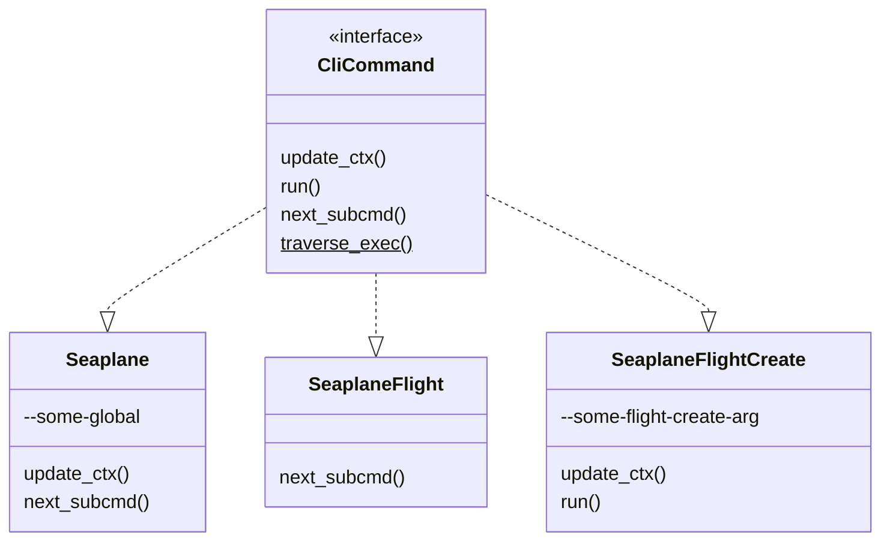

# Seaplane CLI and SDK Architecture

This guide covers design decisions and how the pieces fit together.

## Support Matrix

The Seaplane CLI and SDK library are supported on the following Operating Systems and
Architectures:

|         | Linux | Windows | macOS |
| :-:     | :-:   | :-:     | :-:   |
| x86_64  | Y     | Y       | Y     |
| aarch64 | Y     | N       | Y     |

Using the following target triples:

- `x86_64-unknown-linux-gnu`
- `x86_64-pc-windows-gnu`
- `x86_64-apple-darwin`
- `aarch64-unknown-linux-gnu`
- `aarch64-apple-darwin`

## Code Tour

This section covers the top level code structure. Further details can be found
in each of the dedicated sections about their internal structure.

- `.github/`: CI rules and Github specific metadata
- `doc/`: Documentation relating to the entire project
- `share/`: Additional information, such as third party licenses.

### Seaplane Library

`seaplane/` is the library which interacts with the Seaplane API. This library
contains functions and models for making calls against the Seaplane remote
system.

- `tests/`: All Seaplane library integration tests
- `src/api/`: Types and Functions for interacting with the Seaplane API
- `src/error.rs`: Custom error types that can be matched against and utilized
  when consuming the Seaplane library.

### Seaplane CLI

`seaplane-cli/` is the command line tool that interacts consumes the
`seaplane/` library as reference in how one could utilize the library and
Seaplane API to build something. This tool also functions as the canonical way
to interact with the Seaplane System.

- `tests/`: All integration tests for the CLI.
  - `tests/ui/`: These are UI tests that ensure the input and output of the CLI
  is functioning as
  intended, or doesn't change without us being aware.
- `src/main.rs`: The program entry point
- `src/cli/`: All definitions and entry points for the CLI itself.
  - `cli/cmds/`: The actual CLI command definitions form a tree that mostly
  matches their command hierarchy
  - `cli/error.rs`: Defines common errors with their contexts to de-duplicate
  many commands needing to return the same or similar errors.
- `src/ops/`: The meat of program which interacts with `seaplane/` library
  performs the useful functions.
- `src/config.rs`: Handles loading and (de)serialization of the configuration
  file
- `src/context/`: The "source of truth" for runtime configuration options. This
  is responsible for deconflicting mutually exclusive items, and combining all
  inputs (configuration file, environment, CLI arguments, etc.) into a single
  structure that code can use at runtime to make a decision.
- `src/api.rs`: Wraps the SDK provided calls and makes convenience methods, or converts errors,
  wraps with context, etc. Anything that isn't a one-off touching the SDK should probably go here.
- `src/error.rs`: Provides a custom CLI error and result type for fine grained
  control over the errors, and how they get displayed to the user.
- `src/fs.rs`: Utility functions for interacting with the file system in a
  platform agnostic manner.
- `src/log.rs`: Provides logging levels to allow messages to be suppressed or
  not using configuration options.
- `src/macros.rs`: Provides 
  - printing macros that allow fine grained control
  over output and their colors analogous to the `(e)print(ln)!` and
  `log::{trace,debug,info,warn,error}` macros. 
  - CLI macros to make some
  declarations less verbose and also more consistent
- `src/printer.rs`: Controls how text is sent to STDOUT or STDERR, including
  color management.

## CLI

### Code Structure

Code inside `src/cli.rs` and the corresponding `src/cli/` tree should be
responsible for handling the actual CLI itself, and functions related to it
(such as displaying errors with the appropriate CLI flags and options, etc.).

Where possible, code in this tree should not be doing the *actual work*.
Sometimes this gets blurry, especially early in the projects life as shortcuts
are taken up front and cleaned up later. There are also times where *some* real
work does need to happen within this tree, but these times should be limited to
when that *real work* is directly related to the CLI in some fashion.

Following this will allow the CLI to function as *an* interface to the program,
but not *the* interface. Meaning at some point in future there could be other
interfaces, such as web, TUI, etc.

Ideally, all of these interfaces would call into the exact same modules to do
the real work of the program. A code smell would be the TUI tree (in a
hypothetical `src/tui/`) having to reach into `src/cli/` to perform some
action.

The real work, where possible should reside in `src/ops/`. All CLI `run()`
functions, should be calling out to structures and functions inside `src/ops/`
to actually perform some action.

### CLI Command Structure

The CLI is made up of a series of commands and subcommands forming a tree.

The base, or core command is `seaplane`.

Each subcommand is constructed using an empty marker struct which is a Zero
Sized Type (ZST) that has no runtime memory.

For example the core command `seaplane` is represented as:

```rust
pub struct Seaplane;
```

Subcommands should use their hierarchical path as their struct name as a common
practice. For example, `seaplane flight create` would be represented by:

```rust
pub struct SeaplaneFlightCreate;
```

Each subcommand should provide a static method to construct a `clap::Command`
struct that represents it's CLI. This struct may take additional arguments that
affect the resulting CLI (i.e. allowing for dynamically building the CLI if
required).

### A Common CLI Trait

Subcommands (as well as the core command) will implement a common trait that
allows the runtime execution to traverse down the hierarchy through used
commands. This will allow context to be updated, and code to be executed at
each step along the way.

The trait is defined as:

```rust
pub trait CliCommand {
    fn update_ctx(&self, matches: &clap::ArgMatches, ctx: &mut Ctx) -> Result<(), CliError> {
        Ok(())
    }

    fn run(&self, ctx: &mut Ctx) -> Result<(), CliError> {
        Ok(())
    }

    fn next_subcmd<'a>(
        &self,
        matches: &'a clap::ArgMatches,
    ) -> Option<(Box<dyn CliCommand>, &'a clap::ArgMatches)> {
        None
    }
}
```

Each trait method has a default implementation so that when implementing a new
command, one need only implement the methods that affect runtime behavior.

Further, a [Trait
Object](https://doc.rust-lang.org/book/ch17-02-trait-objects.html) method will
allow for consistently and automatically calling these methods in the proper
order and traversing down the subcommand call chain.

This trait method is designed as follows:

```rust
impl dyn CliCommand + 'static {
    pub fn traverse_exec(&self, matches: &clap::ArgMatches, ctx: &mut Ctx) -> Result<(), CliError> {
        self.update_ctx(matches, ctx)?;
        self.run(ctx)?;
        if let Some((c, m)) = self.next_subcmd(matches) {
            return c.traverse_exec(m, ctx);
        }
        Ok(())
    }
}
```

Notice that `CliCommand::update_ctx` is called, followed by `CliCommand::run`
and ultimately `CliCommand::next_subcmd`.

We'll briefly walk over these trait methods in the next section.

#### `CliCommand::update_ctx`

Allows the subcommand to update the global context with any relevant
information or argument values, or return a error that can be propagated back
to `main` and kill the process.

This method need only be implemented if the subcommand has CLI arguments that
were not inherited from the parent command.

#### `CliCommand::run`

The code execution phase of the subcommand.

This should be implemented by all leaf subcommands, and any intermediate
subcommands that wish to execute arbitrary code.

!!! Attention
    Future versions of this trait may add associated types for return values
    from `CliCommand::run`. At present there is no need for such, but it could
    be a possibility in the future.

#### `CliCommand::next_subcmd`

Dispatches to the next *used* subcommand as a Trait Object with a reference to
that subcommands `clap::ArgMatches` values.

!!! Attention
    This *must* be implemented by all intermediate subcommands

As an example implementation of `next_subcmd`, which would be a good base for
any other commands to implement here is a `SeaplaneAccount` (`seaplane
account`) which dispatches to two other subcommands `SeaplaneAccountToken`
(`seaplane account token`) and `SeaplaneAccountLogin` (`seaplane account
login`):

```rust
impl CliCommand for SeaplaneAccount {
    fn next_subcmd<'a>(
        &self,
        matches: &'a clap::ArgMatches,
    ) -> Option<(Box<dyn CliCommand>, &'a clap::ArgMatches)> {
        match matches.subcommand() {
            Some(("login", m)) => Some((Box::new(SeaplaneAccountLogin), m)),
            Some(("token", m)) => Some((Box::new(SeaplaneAccountToken), m)),
            _ => None,
        }
    }
}
```

**NOTE:** Because the CLI will use Zero Sized Types to construct the CLI making
a Trait Object with a `Box<dyn Trait>` does not allocate, nor does casting to a
`Box<dyn Trait>`.

#### A Diagram

An example flow for a single run of `seaplane flight create` and implementation
matrix would be:



`SeaplaneFlightCreate` is the leaf command and `Seaplane`/`SeaplaneFlight` are
both intermediate.

**NOTE:** Even though `Seaplane` and `SeaplaneFlight` are intermediate
subcommands, they can still implement `run` and `update_ctx` if desired. In the
above example `Seaplane` defines CLI values not inherited from any parent
(because there is no parent) and thus updated the global context with any
appropriate values. `SeaplaneFlight` defined no additional CLI arguments, and
has no need to run code, so only `next_subcmd` is implemented.

### Configuration

See [`CONFIGURATION_SPEC.md`](CONFIGURATION_SPEC.md) in this repository for details on the
configuration file format and structure.

There are two primary types used throughout the application "Contexts" and
"Configs." These can be thought of as the "normalized/processed" and "raw"
options respectively.

Types named `Config` or that end in `...Cfg` are responsible for
(de)serializing raw files. These files are primarily designed with the *user*
and ergonomics as the primary concern. This means at times, there will be
conflicting options, or items which don't fit neatly into a struct that would
optimal to pass around throughout the application. If we did, at each *point of
use* the code would need to ensure all invariants are upheld manually.

Instead, we take the approach that the Context (`Ctx` or types ending in
`...Ctx`) are optimal for passing around the application as all invariants are
already check, mutually exclusive options handled, etc.

#### Example (Color Handling in the CLI)

A good example of this is with the CLI and color handling. First, some back
story to understand the problem at hand.

When we write output we can add color to it by include special ANSI color
codes. In a terminal these get displayed as fancy colors. However, if the
output stream is not a terminal, it looks like garbage printed to the
screen/file (i.e. Instead of a red `foo` you'd see `\u001b[31mfoo`). For this
reason, some users only want to color the output in some circumstances with the
option to turn on or off these ANSI color codes.

We have chosen to turn color *on* by default, but allow users to turn it off
with a CLI flag (`--no-color`).

Now imagine a user doesn't agree with our choice of opt-out. So they alias
`seaplane` to `seaplane --no-color`. But then comes a day where that same user
*does* want color output, but perhaps only for a certain invocation? So we also
provide a `--color` flag. This may seem silly since our default is to already
color the output. But by adding both a `--no-color` and `--color` flag, and
allowing these two mutually exclusive flags to override each-other our user can
now just happily add `--color` to their command without having to mess about
with their alias, or such fuss!

Now if we zoom in at the implementation level, that means we'd have two fields
(the real implementation is slightly different):

```rust
Config {
  color: bool,
  no_color: bool
}
```

But passing around a `Config` struct to any function that needs to output
*potentially* colored output is a problem. Because they now need to check *two*
fields and decide what the user *really* wanted (which is this case is actually
harder because it *also* requires checking environments ARGV and seeing which
option came *last*). So instead, we pass around a `Ctx` struct which looks like
this:

```rust
Ctx {
  color: bool
}
```

Where some other initialization and conversion function is responsible for
taking in the raw unprocessed `Config` struct and creating or updating the
`Ctx` struct that is optimal to pass around the application.

Now those use cases that want to check if they should color output or not can
look at a single field and know that all the behind the scenes invariant
checking is already done.

We take this same approach with both CLI options and Config Files. Everything
is combined, normalized checked into a `Ctx` struct. Only in very rare (read
super early in the application startup) should a function be looking at the raw
`Config` values to make any decision.
