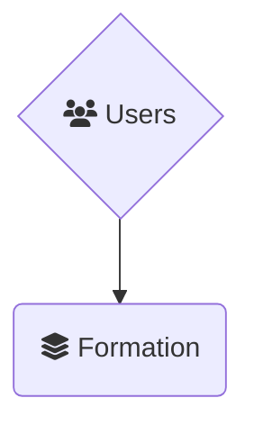
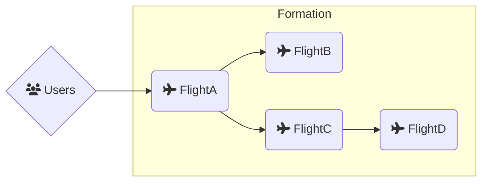
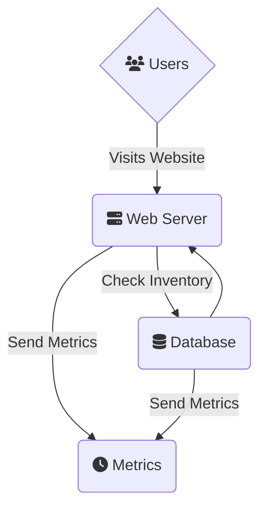
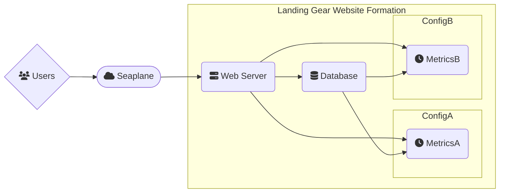
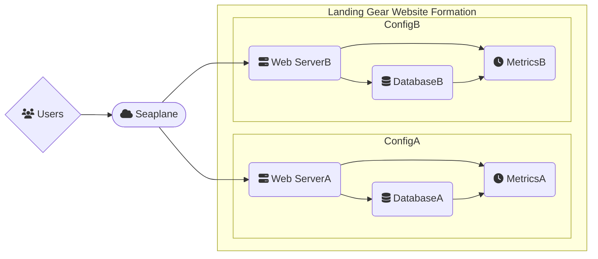

# Seaplane Terminology

This document describes the various terms used throughout Seaplane and the associated CLI/SDK.

The best way to introduce these terms is in reverse, from the outer most component that you'll
interact with the most, to the physical components running underneath the hood. This is because we
want you to think about your applications and services in this order; you shouldn't need to worry
about the low level building blocks unless we've done something wrong!

So bear with us as explain each term in turn!

## Formation

At the heart of Seaplane is your `formation`(s). Formations can be thought of as your high level
*application* or *service*. This is the entry point for all public traffic.

A `formation` is made up of two items, `configuration`s and `flight`s. We'll discuss `flight`s in a
moment.

### Formation Configurations

Each `formation` has a `configuration`. This `configuration` tell us how to build your `formation`
along with other details like what type of traffic should be allowed.

One thing that makes `formation`s a little different, and quite powerful is that they can actually
have multiple `configuration`s! They can even have multiple active `configuration`s (we refer to
those as `In Air`) and multiple inactive (`Grounded`) `configuration`s!

A `configuration` who's status is `In Air` is one that Seaplane is actively sending traffic to.
Having multiple `configuration`s from a single `formation` listed as `In Air` means Seaplane is
load balancing between them based on the defined traffic weight setting of each configuration.

A `configuration` who's status is `Grounded` is one that has been `deploy`ed (uploaded to
Seaplane), but is not yet `In Air` (being utilized).

#### Deployed Configurations

When you create a new `formation configuration` using the `seaplane` CLI tool, that configuration
only resides locally on your computer. You can edit or view this `configuration` freely without
affecting any of the systems running in the Seaplane Cloud. Once you're satisfied, you can `deploy`
the `configuration` to our Seaplane Cloud.

Once a configuration has been `deploy`ed successfully, it now resides in our Seaplane Cloud and is
able to `launch` at which point it's status will change from `Grounded` to `In Air` and traffic
will be sent to any of the `flight`s that it describes. Do note that there are command line options
for `launch`ing a `configuration` immediately when `deploy`ed.

**NOTE:** Just like their `configuration`s, a `formation` will be displayed as `deploy`ed or not
depending on if it's definition is only local to your computer, or has been `deploy`ed (uploaded)
to the Seaplane Cloud. A `formation`'s status will change to `In Air` from `Grounded` by having at
least one `configuration` `In Air`, not by any manual interaction.

Which brings us to what `formation`s are actually made up of, and what these `configuration`s are
actually describing.

That's the `flight`!

## Flight

A `flight` is logically a single container. However, under the hood we spin up many actual
*container instances* and spread them around the globe or within regions you specify.

When your users send traffic to Seaplane, it gets routed to the appropriate `formation` who's
configuration describes the actual `flight`s it is made up of, and who ultimately receive and
process the user traffic.

To take a step back and describe a scenario in industry terms, imagine you are setting up a website
to sell your state of the art Airplane Landing Gear (sticking within our motif). Like many modern
web applications, your website will be made up of a few different components; a front facing
webserver, a backend database, and perhaps a backend metrics platform. You've already created the
container images for each of these components, and if you were to draw out a diagram of how they
interconnect, it would look something like this:

The important point is your webserver is the only component receiving public traffic, but the
backend components all may need to network with one another to form the entire service.

If we translate this into Seaplane terms we still get the exact same diagram, but we would describe
it like so:

- A "Landing Gear Website" `formation`
- The `formation`s `configuration` would specify
  - That it is made up of three `flight`s
    - A "webserver" `flight`
    - A "database" `flight`
    - A "metrics" `flight`
  - How public traffic arrives, and which `flight` to send it to
  - How the `flight`s are allowed to communicate/network with each-other

Now what's *really* neat to us, is that each of these `flight`s is not just a single physical
container, but it's own CDN like cluster! This makes your service (the Landing Gear Website in our
example) much more robust, and can drastically increase your performance as you sell these landing
gear to customers around the globe!

Additionally, let's say you had a version 2.0 of this Landing Gear Website you wanted to roll
out. Perhaps it swaps out one metrics server for another, or maybe it consists of entirely
different `flight`s in total.

You can add a new `configuration` to the existing `formation`. Once activated, Seaplane will
balance between your two version. Since these two "versions" could be referencing the same
`flight`s, you can swap out only the parts you want to balance between. Or if you want to do full
on `A`/`B` testing, all the `flight`s could be different, the sky is the limit!

To visualize the example, image we kept it simple and the only difference between these two
`configuration`s is the metrics platform. After `deploy`ing and `activate`ing the second
configuration, your diagram would look like this:

**NOTE:** This diagram is *slightly* misleading as technically both `ConfigA` and `ConfigB` declare
the `Web Server` and `Database` (i.e. they're shared). However mermaid diagrams aren't quite able
to depict a shared subgraph, so we elected to only highlight the *differences* in configurations.

In the more complex scenario, where *all* `flight`s are different, it would look like this:

## Container Instance

The lowest level component we should address, and we've already mentioned it a few times is the
actual Container Instances themselves. We don't bring this up first, because if everything is
working as it should, these are invisible to you and your users. Logically, the `flight` is your
container instance.

That being said, there are *rare* occurrences where you will need to think about how Seaplane is
distributing your traffic, and in those instances it's important to know that there are actual
container instances running under the hood.

These container instances are controlled by your `flight` and `formation` configuration. For the
most part, you can let Seaplane handle the details of how they get distributed. However, it is
possible to network between physical container instances individually when coordination is
necessary. Doing so is outside the scope of this guide, and is normally handled out-of-band.

## Container Image

Just like the container images you know an love from all your standard OCI compliant tools. There
is nothing fancy here. We instantiate your container instances, which make up your `flight`s and
form your `formation`s from good ol' standard OCI images.
